# Implementierungsplan: Tagestyp Dienstgang / Dienstreise

## 1. Übersicht & Ziel
Einführung des neuen Tagestyps **Dienstgang / Dienstreise** (`DayType.BUSINESS_TRIP`):
- **10-Stunden-Regel:** Bei Dienstreisen gilt die Reisezeit von Wohnungstür bis Wohnungstür. Das Überschreiten der gesetzlichen 10-Stunden-Grenze ist hier zulässig.
  - Arbeits- bzw. Reisezeit wird **nicht** bei 10 Stunden (600 Minuten) gekappt.
  - Die Warnmeldung *"Achtung: Max. 10h Arbeitszeit überschritten!"* wird bei Dienstreisen unterdrückt bzw. nicht ausgelöst (`exceedsMaxHours = false`).
- **Pausenregelung (Modell 2 – 1:1 Tür-zu-Tür):**
  - **Kein automatischer Pausenabzug:** Gesetzliche Pausen (30 min ab 6h, 45 min ab 9h) werden bei Dienstreisen **nicht** automatisch abgezogen. Ein durchgehender Block von 07:00 bis 19:00 Uhr zählt volle 12:00h Netto-Arbeitszeit.
  - **Manuelle Pausen:** Nur tatsächlich erfasste Unterbrechungen (Lücken zwischen Zeitblöcken) zählen als Pause.
  - **Keine Pausen-Warnungen:** ArbZG-Pausenwarnungen (*"Über 6h ohne Pause"*, *"Pause zu kurz"*) werden bei Dienstreisen unterdrückt.
- **Gleitzeit & Arbeitszeit:** Dienstreisen zählen wie reguläre Arbeitstage (`DayType.WORK`) zur Arbeits- und Gleitzeit (an Werktagen Verrechnung mit Tagessoll, an Wochenenden volle Gutschrift).
- **Kein Versions-Upgrade:** Die App-Version bleibt unverändert auf `1.7.7` (`versionCode = 16`).
- **Planung & Übersicht:** Unterstützung in der Monatsansicht, Planung (`PlanType.BUSINESS_TRIP`), Jahresübersicht, Exporten (PDF/CSV/ICS) und Kalendersynchronisation.

---

## 2. Architektur & Schnittstellen

```mermaid
flowchart TD
    subgraph Domain
        DT["DayType.BUSINESS_TRIP"]
        CDW["CalculateDayWorkTimeUseCase(isBusinessTrip = true)"]
        CBV["CheckBreakViolationUseCase (skip on BUSINESS_TRIP)"]
        CF["CalculateFlextimeUseCase"]
        CQ["CalculateQuotaUseCase"]
        CA["CalculateAnalyticsUseCase"]
        PED["PrepareExportDataUseCase"]
    end

    subgraph Data
        ES["ExportService (PDF/CSV Label 'Dienstreise')"]
        ICS["IcsExportService & CalendarEventMapper"]
        DB["Room WorkDayEntity (TEXT mapping)"]
    end

    subgraph UI
        Theme["Theme.kt (BusinessTripColor Teal)"]
        Home["HomeScreen & HomeViewModel"]
        Month["MonthScreen & MonthViewModel"]
        Planning["PlanningScreen & PlanningViewModel"]
        Year["YearOverviewScreen & ViewModel"]
        Settings["CalendarSettingsScreen"]
    end

    DT --> CDW
    DT --> CBV
    DT --> CF
    DT --> CQ
    DT --> CA
    DT --> PED
    DT --> ES
    DT --> ICS
    DT --> DB
    DT --> Home
    DT --> Month
    DT --> Planning
    DT --> Year
```

---

## 3. Subagent-Aufteilung & Arbeitspakete

### 🤖 Subagent 1: Domain & Model Layer (TDD)
**Scope:** Kernlogik, Zeiterfassung & Use Cases
- **Dateien:**
  - [`DayType.kt`](file:///Users/abauer/dev/flex/app/src/main/java/com/flex/domain/model/DayType.kt): Hinzufügen von `BUSINESS_TRIP`
  - [`CalculateDayWorkTimeUseCase.kt`](file:///Users/abauer/dev/flex/app/src/main/java/com/flex/domain/usecase/CalculateDayWorkTimeUseCase.kt):
    - Parameter `isBusinessTrip: Boolean = false` hinzufügen.
    - Wenn `isBusinessTrip == true`:
      - `netMinutes` wird **nicht** bei `MAX_WORK_MINUTES` (600L) gekappt.
      - `exceedsMaxHours` ist `false`.
      - **Modell 2:** Kein automatischer Pausenabzug! Wenn Blöcke keine echten Lücken haben, ist `effectiveBreak = totalGapMinutes` (also 0 bei Einzelblock). Nettozeit = Gesamtbruttozeit minus Lücken.
  - [`CheckBreakViolationUseCase.kt`](file:///Users/abauer/dev/flex/app/src/main/java/com/flex/domain/usecase/CheckBreakViolationUseCase.kt):
    - Wenn `isBusinessTrip == true`: Rückgabe `BreakCheckResult(violations = emptyList(), skipped = true)` (keine Warnungen).
  - [`CalculateFlextimeUseCase.kt`](file:///Users/abauer/dev/flex/app/src/main/java/com/flex/domain/usecase/CalculateFlextimeUseCase.kt):
    - Behandlung von `DayType.BUSINESS_TRIP` analog zu `DayType.WORK`, übergibt `isBusinessTrip = true`.
  - [`CalculateAnalyticsUseCase.kt`](file:///Users/abauer/dev/flex/app/src/main/java/com/flex/domain/usecase/CalculateAnalyticsUseCase.kt):
    - Unterstützung von `DayType.BUSINESS_TRIP` mit ungedeckeltem Tagessaldo und `isBusinessTrip = true`.
  - [`CalculateQuotaUseCase.kt`](file:///Users/abauer/dev/flex/app/src/main/java/com/flex/domain/usecase/CalculateQuotaUseCase.kt):
    - `DayType.BUSINESS_TRIP` zählt als Arbeitstag (nicht in `neutralTypes`), übergibt `isBusinessTrip = true`.
  - [`PrepareExportDataUseCase.kt`](file:///Users/abauer/dev/flex/app/src/main/java/com/flex/domain/usecase/PrepareExportDataUseCase.kt):
    - Aufnahme in `isWorkType`, ungedeckelte Berechnung ohne automatische Pausen.
  - [`CalendarEventMapper.kt`](file:///Users/abauer/dev/flex/app/src/main/java/com/flex/calendar/CalendarEventMapper.kt):
    - Event-Titel für `DayType.BUSINESS_TRIP`: `"Dienstreise 🚆"`
- **Akzeptanzkriterien:**
  - 12h Block (07:00–19:00) mit `isBusinessTrip = true` ergibt 720 min brutto, 720 min netto, 0 min Pause, `exceedsMaxHours = false`.
  - Zwei Blöcke (08:00–12:00, 13:00–18:00) mit `isBusinessTrip = true` ergeben 540 min netto (9h), 60 min Pause (Lücke), `exceedsMaxHours = false`.
  - Regulärer Tag (07:00–19:00) mit `isBusinessTrip = false` ergibt weiterhin 600 min netto, 45 min Pause, `exceedsMaxHours = true`.
  - Unit Tests in [`CalculateDayWorkTimeUseCaseTest.kt`](file:///Users/abauer/dev/flex/app/src/test/java/com/flex/domain/usecase/CalculateDayWorkTimeUseCaseTest.kt) und [`CalculateFlextimeUseCaseTest.kt`](file:///Users/abauer/dev/flex/app/src/test/java/com/flex/domain/usecase/CalculateFlextimeUseCaseTest.kt) laufen 100% grün.

---

### 🤖 Subagent 2: Data & Export Layer
**Scope:** Export-Services, Kalender & Settings
- **Dateien:**
  - [`ExportService.kt`](file:///Users/abauer/dev/flex/app/src/main/java/com/flex/data/export/ExportService.kt):
    - `dayTypeLabel(DayType.BUSINESS_TRIP)` -> `"Dienstreise"`
  - [`IcsExportService.kt`](file:///Users/abauer/dev/flex/app/src/main/java/com/flex/data/export/IcsExportService.kt):
    - Synchronisation & Export für Dienstreisen unterstützen (Location z. B. "Dienstreise" oder wie effectiveLocation).
  - [`SettingsEntity.kt`](file:///Users/abauer/dev/flex/app/src/main/java/com/flex/data/local/entity/SettingsEntity.kt) & [`Settings.kt`](file:///Users/abauer/dev/flex/app/src/main/java/com/flex/domain/model/Settings.kt):
    - Default `calendarSyncTypes`: `"WORK,BUSINESS_TRIP,VACATION,SICK_DAY,FLEX_DAY,SPECIAL_VACATION,OVERTIME_DAY,SATURDAY_BONUS"`
- **Akzeptanzkriterien:**
  - PDF/CSV-Export zeigt bei `BUSINESS_TRIP` das Label "Dienstreise" an.
  - Kalenderexport und Sync-Filter verarbeiten `BUSINESS_TRIP` ohne Fehler.
  - Unit Tests in `ExportServiceTest` und `IcsExportServiceTest` erfolgreich.

---

### 🤖 Subagent 3: UI Layer (Compose Screens & ViewModels)
**Scope:** Benutzerinteraktion, Dialoge, Farbgebung & Darstellungen
- **Dateien:**
  - [`Theme.kt`](file:///Users/abauer/dev/flex/app/src/main/java/com/flex/ui/theme/Theme.kt):
    - Farbdefinition: `val BusinessTripColor = Color(0xFF00897B)` (Teal / Petrol)
  - [`EditDayDialogState.kt`](file:///Users/abauer/dev/flex/app/src/main/java/com/flex/ui/month/EditDayDialogState.kt):
    - `BUSINESS_TRIP` öffnet standardmäßig den Tab `Start / Ende` wie ein normaler Arbeitstag.
  - [`HomeScreen.kt`](file:///Users/abauer/dev/flex/app/src/main/java/com/flex/ui/home/HomeScreen.kt) & [`HomeViewModel.kt`](file:///Users/abauer/dev/flex/app/src/main/java/com/flex/ui/home/HomeViewModel.kt):
    - Tagestyp-Auswahlchip für `BUSINESS_TRIP` (Label "Dienstreise", Icon `Icons.Default.Commute`, Farbe `BusinessTripColor`).
    - Berechnung `isBusinessTrip = (selectedDayType == DayType.BUSINESS_TRIP)`.
    - Unterdrückung der roten 10h-Warnung und der Pausenwarnungen.
  - [`MonthScreen.kt`](file:///Users/abauer/dev/flex/app/src/main/java/com/flex/ui/month/MonthScreen.kt) & [`MonthViewModel.kt`](file:///Users/abauer/dev/flex/app/src/main/java/com/flex/ui/month/MonthViewModel.kt):
    - `EditDayDialog`: FilterChip für `BUSINESS_TRIP`.
    - Zeiterfassung Tabs (Start/Ende und Gesamtzeit) aktiv für Dienstreise.
    - Kalenderkachel & Tagesliste: Akzentstreifen, Farbkodierung `BusinessTripColor`, Label "Dienstreise".
    - `workingDaysMonth`: `BUSINESS_TRIP` einbinden mit `isBusinessTrip = true` in `calculateDayWorkTime`.
  - [`PlanningScreen.kt`](file:///Users/abauer/dev/flex/app/src/main/java/com/flex/ui/planning/PlanningScreen.kt) & [`PlanningViewModel.kt`](file:///Users/abauer/dev/flex/app/src/main/java/com/flex/ui/planning/PlanningViewModel.kt):
    - `PlanType.BUSINESS_TRIP("Dienstreise")` hinzufügen.
    - Mapping zu `WorkLocation.OFFICE to DayType.BUSINESS_TRIP`.
    - Planungs-Chip & Kalender-Highlight mit `BusinessTripColor`.
  - [`YearOverviewScreen.kt`](file:///Users/abauer/dev/flex/app/src/main/java/com/flex/ui/year/YearOverviewScreen.kt) & [`YearOverviewViewModel.kt`](file:///Users/abauer/dev/flex/app/src/main/java/com/flex/ui/year/YearOverviewViewModel.kt):
    - `businessTripDays` im `YearSummary` zählen und in Legende/Heatmap anzeigen.
  - [`CalendarSettingsScreen.kt`](file:///Users/abauer/dev/flex/app/src/main/java/com/flex/ui/settings/CalendarSettingsScreen.kt):
    - Dialoge zur Typauswahl um `BUSINESS_TRIP` ("Dienstreise") erweitern.
- **Akzeptanzkriterien:**
  - UI-Tests und ViewModel-Tests (`HomeViewModelTest`, `MonthViewModelTest`, `PlanningViewModelTest`, `EditDayDialogStateTest`) laufen fehlerfrei durch.
  - Nutzer kann auf Home und im Monatsscreen "Dienstreise" auswählen und Zeiten >10h buchen.

---

### 🤖 Subagent 4: Changelog, Verification & Build
**Scope:** Dokumentation, Build & Test Suite (kein Version-Bump!)
- **Dateien:**
  - [`app/src/main/assets/changelog.md`](file:///Users/abauer/dev/flex/app/src/main/assets/changelog.md): Eintrag für neues Feature `Tagestyp Dienstreise mit Reisezeit Wohnungstür-zu-Wohnungstür, Aufhebung der 10h-Kappung und ohne automatischen Pausenabzug`
  - *(Kein Versions-Upgrade in build.gradle.kts)*
- **Verifikationsschritte:**
  - Unit Tests: `./gradlew testDebugUnitTest`
  - Android Tests kompilieren: `./gradlew compileDebugAndroidTestKotlin`
  - Debug Build erstellen: `./gradlew assembleDebug`
- **Wichtig:** Keine automatischen Git-Commits! Commit nur auf ausdrücklichen Befehl des Users.

---

## 4. Akzeptanz- und Verifikationskriterien
1. **Keine 10h-Kappung:** Bei `DayType.BUSINESS_TRIP` werden auch Arbeitszeiten über 10h vollständig im Gleitzeitkonto gutgeschrieben.
2. **Keine 10h-Warnmeldung:** Auf dem Homescreen erscheint bei Dienstreisen über 10h keine Fehler-/Warnmeldung zur 10h-Überschreitung.
3. **Pausenabzug nach Modell 2:** Kein automatischer Pausenabzug; nur manuell eingelegte Lücken zwischen Blöcken zählen als Pausen. Pausenwarnungen werden unterdrückt.
4. **Build & Tests:** Alle Unit-Tests und Build-Targets kompilieren und passieren ohne Regressionen.
